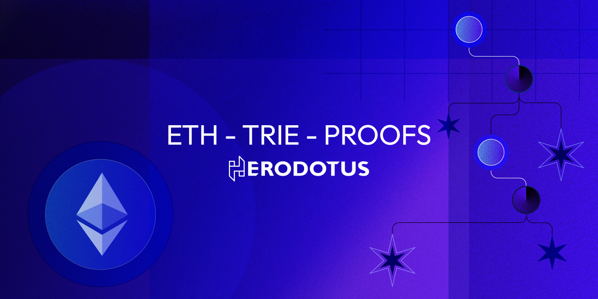

# eth-trie-proofs

A comprehensive proofs handler for Ethereum trie. Tested with various EIPs including Legacy, EIP-2930, EIP-1559, and EIP-4844. This repository exposes the proof building functionalities, and a CLI version.

## Features

- **Transaction Trie Handler**

  - [x] Build a trie with a target block number
  - [x] Build a trie with a target transaction hash
  - [x] Retrieve proof by transaction index
  - [x] Verify proof

- **Transaction Receipt Trie Handler**
  - [x] Build a trie with a target block number
  - [x] Build a trie with a target transaction hash
  - [x] Retrieve proof by transaction index
  - [x] Verify proof

## CLI Tool
The CLI tool supports generating proofs for transactions and receipts. Use the following commands based on your requirements:

Install with: `cargo install --path ./`

Or, run without installing:  `cargo run --bin etp-cli`


**Generate a Proof via CLI**

To generate a proof for a transaction, use the following command:

`etp-cli tx <TRANSACTION_HASH> [RPC_URL]`

To generate a receipt proof:

`etp-cli receipt <TRANSACTION_HASH> [RPC_URL]`

As a default, `https://ethereum-rpc.publicnode.com` is used as an RPC provider. This will probably work for recent transactions, but it is advised to use a dedicated RPC.

## Installation

Use the following command to add `eth-trie-proofs` to your project:

```bash
❯ cargo add eth-trie-proofs
```

## Example

### Building a Transaction Trie with a Target Block Number or Target Transaction Hash

```rust
let target_tx_hash = B256::from(hex!(
    "1fcb1196d8a3bff0bcf13309d2d2bb1a23ae1ac13f5674c801be0ff9254d5ab5"
));

let mut txs_mpt_handler = TxsMptHandler::new(MAINNET_RPC_URL)?;

txs_mpt_handler
    .build_tx_tree_from_block(4370000)
    .await?;

let tx_index = txs_mpt_handler.tx_hash_to_tx_index(target_tx_hash)?;
let proof = txs_mpt_handler.get_proof(tx_index)?;
txs_mpt_handler
    .verify_proof(tx_index, proof.clone())?;

// You can either build with target tx hash. Both roots match.
let mut txs_mpt_handler2 = TxsMptHandler::new(MAINNET_RPC_URL)?;
txs_mpt_handler2
    .build_tx_tree_from_tx_hash(target_tx_hash)
    .await?;

assert_eq!(
    txs_mpt_handler.get_root().unwrap(),
    txs_mpt_handler2.get_root().unwrap()
);
```

### Building a Transaction Receipts Trie with a Target Block Number

```rust
// 4844 transaction
let target_tx_hash = B256::from(hex!(
    "9c1fbda4f649ac806ab0faefbe94e1a60282eb374ead6aa01bac042f52b28a8c"
));

let mut tx_receipts_mpt_handler = TxReceiptsMptHandler::new(MAINNET_RPC_URL)?;
tx_receipts_mpt_handler
    .build_tx_receipts_tree_from_block(19426589)
    .await?;

let tx_index = tx_receipts_mpt_handler
    .tx_hash_to_tx_index(target_tx_hash)
    .await?;
let proof = tx_receipts_mpt_handler.get_proof(tx_index)?;
tx_receipts_mpt_handler
    .verify_proof(tx_index, proof.clone())?;
```

### Credit

For trie implementation, this project depends on the [eth_trie](https://crates.io/crates/eth_trie).
For transaction and transaction receipt types, heavily depends on the [alloy](https://github.com/alloy-rs/alloy).
